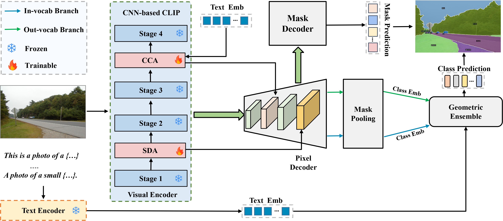

# Boosting Generalization via Adapter: Enhancing Robustness CLIP for Open-Vocabulary Segmentation

This repo contains the code for our paper [**Boosting Generalization via Adapter: Enhancing Robustness CLIP for Open-Vocabulary Segmentation**]

  

 

*BGA* is an universal model for open-vocabulary image segmentation problems, consisting of a class-agnostic segmenter, in-vocabulary classifier, out-of-vocabulary classifier. With everything built upon a shared single frozen convolutional CLIP model,*BGA* not only achieves state-of-the-art performance on various open-vocabulary segmentation benchmarks, but also enjoys a much lower training (10 days with 4 A6000) and testing costs compared to prior arts.

## Installation

See [installation instructions](INSTALL.md).

## Getting Started

See [Preparing Datasets for BGA](datasets/README.md).

See [Getting Started with  BGA](GETTING_STARTED.md).

## Acknowledgement

[Mask2Former](https://github.com/facebookresearch/Mask2Former)

[ODISE](https://github.com/NVlabs/ODISE)

[FCCLIP](https://github.com/bytedance/fc-clip)

[FreeSeg](https://github.com/bytedance/FreeSeg)
